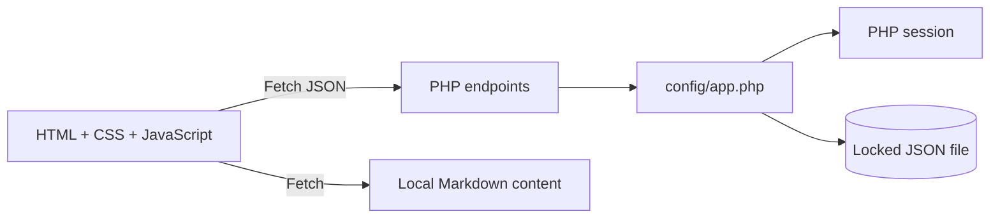

# Learning Hub Technical Report

## Result

The project now runs as an LMS with native browser JavaScript, the restored Bootstrap-based visual layer, PHP JSON endpoints, PHP sessions for identity, and a locked JSON file for accounts and learning state.

## Implemented features

- Registration with username/email validation and hashed passwords
- Successful and failed login event recording
- Login, session check, and logout
- Static course catalog served through the API
- Authenticated enrollment and “My courses” data
- Authenticated progress read/update, including unmarking chapters
- Local Markdown lesson loading without a third-party parser
- Responsive navigation, dark mode, course cards, auth forms, and course sidebar

## Architecture

The API owns authentication and learning state. The browser keeps only the visual theme in `localStorage`; credentials and progress are server-side.

## Verification

`tests/api-smoke.mjs` checks registration, a failed login record, successful login, session identity, enrollment, progress completion, progress removal, and logout against a running PHP server. PHP syntax and JavaScript syntax are checked independently.

## Deployment constraint

On a normal PHP host the JSON path can be durable. On Vercel, the approved no-database version stores JSON and sessions in `/tmp`; data may disappear or split across instances. It must not be treated as production persistence.

## Team

| Name | NRP | Contribution |
|---|---|---|
| Maulana Ikhsan | 5025241163 | Frontend development |
| Adriel Mahira Dharma | 5025241097 | Backend development |
| Ja'far Balyan Al Karim | 5025241040 | Learning content |
